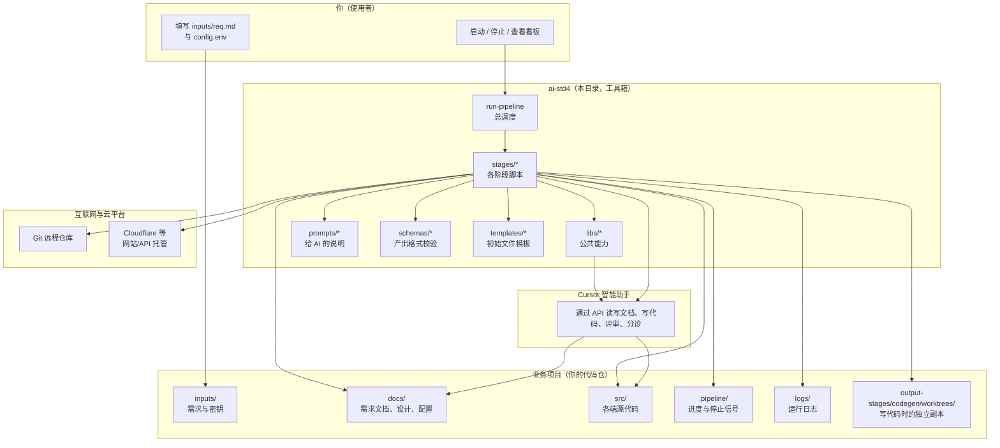
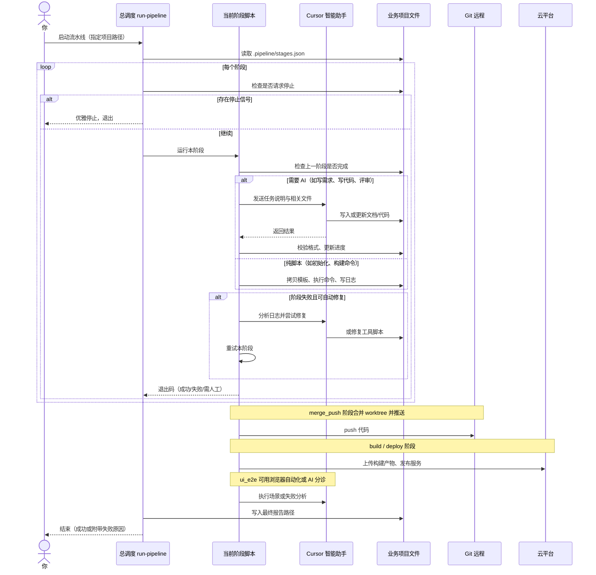
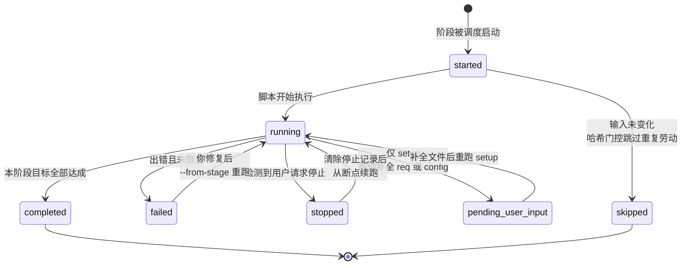

# ai-std4 — 从想法到上线的自动助手

## 这个项目是做什么的？

**ai-std4** 是一套「一条龙」自动化工具：你只要在自己的业务项目里写好**想做什么**（需求说明），并填好必要的配置（例如访问 AI 的密钥、云平台账号），它就会按固定顺序，自动完成从整理需求、做设计、写代码、合并上传、编译打包、部署上线，到界面验收和总结报告的全过程。

你可以把它理解成一位**按清单干活的数字团队**：不会跳步，每步做完会记下进度；某步出问题时会尽量自动补救，实在不行会停下来告诉你该改哪里。

### 你能用它实现什么？

| 你想做的事 | ai-std4 能帮你 |
| --- | --- |
| 有一个新产品的想法，想快速落成可访问的网站/App/后台 | 根据 `inputs/req.md` 自动生成各端需求文档、技术设计，并在独立工作区里写实现代码 |
| 多端产品（网站、手机 App、管理后台、服务端 API 等） | 按你在需求里勾选的「端」分别产出文档和代码，并处理功能之间的先后依赖 |
| 不想手动盯每一步 | 一条命令跑完全程，或用看板查看当前卡在哪一步 |
| 部署到 Cloudflare 并做基本验收 | 自动构建、上线，并按场景做界面自动化检查（可选） |
| 中途暂停或从某步接着跑 | 支持优雅停止、从指定阶段续跑 |

**你需要准备的**：一个空的或已有的**业务项目文件夹**（你的代码仓）、Node.js 18+、Cursor 的 API 密钥，以及（若要上线）云平台的访问配置。本目录（`ai-std4`）里的脚本**不会复制进业务仓**，始终从这里调用。

**触发方式（在 Cursor 里对话）**：说「ai-std4」「全量流水线」「运行 std4」等；或在终端执行下文「如何开始」中的命令。

---

## 如何开始（简要）

```bash
# 在 skill 目录安装依赖（首次）
cd ai-std4 && npm install

# 在业务项目根目录跑完整流程（把路径换成你的项目）
node ai-std4/scripts/run-pipeline.cjs --project=/path/to/your-project

# 只看进度看板
node ai-std4/scripts/run-dash.cjs --project=/path/to/your-project

# 停止流水线并结束后台子进程（看板、worker 等）
node ai-std4/scripts/stop-pipeline.cjs --project=/path/to/your-project --teardown

# 从某一阶段接着跑（例如只重做部署）
node ai-std4/scripts/run-pipeline.cjs --project=/path/to/your-project --from-stage=deploy
```

首次运行前，请在业务项目的 `inputs/req.md` 和 `inputs/config.env` 中按模板填好内容（`setup` 阶段会自动从本目录的 `templates/` 拷贝模板若文件尚不存在）。

更细的约定见仓库内规范：[docs/spec/std4/std4.md](../docs/spec/std4/std4.md)。

---

## 整体架构（示意图）

下面用四张图说明：**有哪些部分**、**按什么顺序干活**、**一次运行里谁和谁说话**、**每个阶段可能处于什么状态**。

### 1. 架构图 — 有哪些角色、数据放在哪



**读图要点**：

- **业务项目**里放的是「你的东西」：需求、文档、代码、进度文件、日志。
- **ai-std4** 里是「工具」：不搬进你的仓，只被 `node ...` 调用。
- **智能助手**在需要理解、撰写、评审时介入；纯机械步骤（拷贝模板、校验格式、跑构建命令等）由脚本完成。
- **Git 与云**负责保存代码和对外提供服务。

---

### 2. 流程图 — 十三个阶段按什么顺序执行

```mermaid
flowchart LR
  subgraph Prep["准备"]
    S0["① setup<br/>初始化目录与配置"]
  end

  subgraph Doc["需求"]
    S1["② prd<br/>整理需求文档"]
    S2["③ prd-review<br/>评审需求是否可行"]
  end

  subgraph Design["设计"]
    S3["④ design<br/>技术设计"]
    S4["⑤ design-review<br/>评审能否开写代码"]
  end

  subgraph BuildTrack["实现（部分并行）"]
    S5["⑥ create-ui-scenarios<br/>准备界面测试场景"]
    S6["⑦ codegen<br/>写代码"]
    S7["⑧ code-review<br/>代码评审"]
  end

  subgraph Release["发布"]
    S8["⑨ merge_push<br/>合并并上传代码"]
    S9["⑩ build<br/>编译打包"]
    S10["⑪ deploy<br/>部署上线"]
  end

  subgraph Verify["验收与收尾"]
    S11["⑫ ui_e2e<br/>界面自动化测试"]
    S12["⑬ report<br/>生成总结报告"]
  end

  S0 --> S1 --> S2 --> S3 --> S4
  S4 --> S5
  S4 --> S6
  S5 -.->|与 codegen 无互相等待| S6
  S6 --> S7 --> S8 --> S9 --> S10
  S10 --> S11 --> S12
```



**读图要点**：

- 大方向是**从左到右、从上到下**，上一步合格才进入下一步（有门闸）。
- **设计评审通过之后**，「准备界面测试场景」和「写代码」可以**同时进行**，互不挡路。
- **界面自动化测试**要等部署完成（且若你开启了相关配置，还要等部署后的健康检查通过）。
- **报告**在最后执行，汇总整次运行的结果。

---

### 3. 时序图 — 从你按下运行到跑完一轮



**读图要点**：

- **你**只负责启动（和事先填好需求/配置）；中间大量往返在「阶段脚本 ↔ 项目文件 ↔ 智能助手」之间完成。
- **停止**是通过项目里的停止信号文件实现的，不是强行关掉电脑上的进程。
- **失败时**可能触发「自动修复再重试」；修不了会带着明确原因停住。

---

### 4. 状态图 — 单个阶段在进度文件里可能的状态

进度记录在业务项目的 `output-stages/stages.json`（兼容旧路径 `.pipeline/stages.json`）。每个阶段名称下有一个 `status` 字段，取值含义如下：



**读图要点**：

- **completed**：可以进入下一阶段。
- **failed / pending_user_input**：流水线会停；你需要改文件或配置后，用 `--from-stage=...` 从对应阶段再跑。
- **skipped**：上次跑过且输入没变，本次直接跳过，节省时间。
- **stopped**：你主动点了停止或写了停止信号，当前阶段不会记为成功完成。

整条流水线的宏观状态可以理解为：**从 setup 开始，沿阶段链推进，直到 report 完成或在某阶段 failed/stopped/pending**。

---

## 目录里有什么（方便对照）

| 目录 / 文件 | 作用（通俗说法） |
| --- | --- |
| `SKILL.md` | 给 Cursor 看的技能说明与触发词 |
| `scripts/run-pipeline.cjs` | 总开关：按顺序跑各阶段 |
| `scripts/run-dash.cjs` | 终端看板：当前进度一览 |
| `scripts/stop-pipeline.cjs` | 请求安全停止；加 `--teardown` 同时结束后台进程 |
| `scripts/pipeline-teardown.cjs` | 收尾：SIGTERM/SIGKILL 本 session 子进程与看板 |
| `scripts/stages/` | 每个阶段的具体执行脚本 |
| `scripts/libs/` | 公共能力（调 AI、校验、构建、测试等） |
| `prompts/` | 交给智能助手的任务说明原文 |
| `schemas/` | 机器检查 JSON 等产出是否格式正确 |
| `templates/` | 第一次初始化时拷贝到你的项目的空白模板 |

---

## 常见问题（一句话）

| 问题 | 简要回答 |
| --- | --- |
| 和 ai-prd3、ai-codegen2 等老技能的关系？ | ai-std4 **自包含**，不调用那些技能的脚本；思路相近但实现独立。 |
| 代码写在哪？ | 多在 `output-stages/codegen/worktrees/` 里写，**merge_push** 后再进你主分支的 `src/`。 |
| 怎么知道卡在哪？ | 看 `run-dash`，或读 `output-stages/stages.json` 与 `.pipeline/logs/`。 |
| 必须开界面自动化吗？ | 否；在配置里关闭 `ui_e2e` 后，相关阶段会标记为跳过。 |

---

## 相关文档

- 技能入口：[SKILL.md](./SKILL.md)
- 完整技术规范：[docs/spec/std4/std4.md](../docs/spec/std4/std4.md)
- 各阶段说明：[docs/spec/std4/stages/](../docs/spec/std4/stages/)
